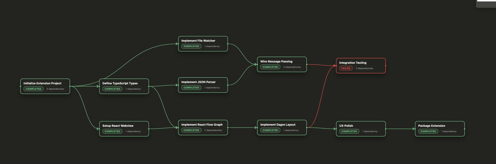

# ATP Visualizer

Visualize [ATP](https://github.com/manuelcecchetto/atp) plan graphs directly inside VS Code.

This extension renders `*.atp.json` plans as an interactive React Flow canvas, with a focused node details card and theming that matches your editor.

## Ecosystem

ATP Visualizer is meant to sit alongside:

- **ATP schema** — canonical spec and examples  
  <https://github.com/manuelcecchetto/atp>
- **ATP MCP server** — exposes ATP plans over MCP and can materialize them as `.atp.json` in your workspace  
  <https://github.com/manuelcecchetto/atp-mcp-server>

You can use the visualizer with:

- Plans generated/managed by the ATP MCP server, or
- Any hand-authored `.atp.json` that conforms to the schema.

## Features

- **Graph view**
  - One node per ATP task; edges follow `dependencies`.
  - Automatic DAG layout (left‑to‑right) via Dagre.
  - Edges animate when the target node is `CLAIMED`.
  - Minimap and controls themed with VS Code colors.

- **Status‑aware styling**
  - Node chrome and edge colors reflect `NodeStatus` (`LOCKED`, `READY`, `CLAIMED`, `COMPLETED`, `FAILED`).
  - Clicking or dragging a node highlights it with a status‑tinted gradient.

- **Details HUD**
  - Bottom overlay shows the currently focused node:
    - Title, status pill, worker, dependency count.
    - Sections for `Instruction`, `Context`, `Report`, and `Artifacts` with subtle dividers.
  - Clicking on the canvas background clears the selection.

- **Live updates**
  - A `FileSystemWatcher` tracks `**/*.atp.json`.
  - Changes trigger a refresh and re‑layout of the graph.

## Getting Started

1. Install the extension (from VSIX or Marketplace, when available).
2. Open a workspace containing an `*.atp.json` plan.
   - If you are using the [ATP MCP server](https://github.com/manuelcecchetto/atp-mcp-server), open the plan file it writes into your workspace.
3. Run **ATP Visualizer: Open** to launch the webview.
4. Interact with the graph:
   - Click/drag nodes to inspect them in the details HUD.
   - Edit the underlying JSON; the view refreshes automatically or via **ATP Visualizer: Refresh**.

## Commands

- `ATP Visualizer: Open` — `atp-visualizer.openVisualizer`
- `ATP Visualizer: Refresh` — `atp-visualizer.refresh`

## Requirements

- VS Code `^1.106.1`.
- Plan files must follow the ATP JSON schema (`*.atp.json`) from <https://github.com/manuelcecchetto/atp>.

## Development

- `pnpm install` — install dependencies.
- `pnpm run watch` — rebuild on changes (extension + webview).
- `pnpm run compile` — one‑off production build.
- `pnpm run package` — build a `.vsix` for local installation.

## Release Notes

### 0.1.0

- Initial release with:
  - Dagre‑based layout and themed minimap.
  - Animated edges for `CLAIMED` targets.
  - Node selection highlight + bottom details card.
  - Automatic refresh on `.atp.json` changes.
